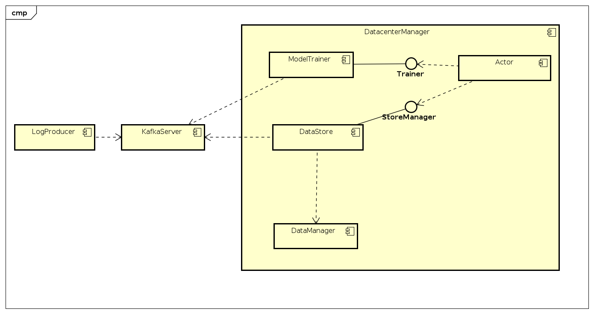

# ForexSpark
`version`: 1.0  

## Mô tả   
### Mục đích
Project cho môn học big data, thực hiện mô phỏng dữ liệu forex realtime.
Dữ liệu được cung cấp bởi https://eaforexacademy.com/software/forex-historical-data/
Hệ thống sử dụng dữ liệu forex của USD và EUR, GBP và USD
### Kiến trúc hệ thống 
Về tổng quan, luồng dữ liệu được di chuyển theo thứ tự:  
1. Dữ liệu được crawl về và gửi lên kafka server theo dạng streaming
2. Bộ xử lý dữ liệu sẽ lấy dự liệu từ server kafka và xử lý theo kiến trúc lambda, từ là sẽ gồm 2 phần chính:  
    - DataStoreHDFS: Nhận dữ liệu từ kafka server và lưu lại vào trong hệ thống hadoop  
    - Spark: Xử lý real-time dữ liệu bằng notebook 
    

Dưới đây là component diagram của hệ thống:  



## Cài đặt 

Ta sẽ cài đặt hệ thống trên cụm docker container.

*Thông tin*  
kafka bootstrap server: kafka:9092  
hadoop default FS: hdfs://hadoop-namenode:8020  
spark master: spark://spark-master:7077   
spark master gui: localhost:8080  

### Yêu cầu 
docker-compose version >= 1.27.4
docker Engine >= 19.03.12

### Cài đặt cluster 

#### Tạo các image cần thiết
```bash
$cd Enviroments
$bash build_images.sh
```
#### Hadoop Server 
*Tạo cụm hadoop*  

```bash
$cd Enviroments/hdfs_system/
$bash run.sh
```
Sau khi khởi động thế thông hdfs thì terminal sẽ chuyển đến terminal của hệ thống hadoop, tại đó, ta sẽ tạo thư mục cần thiết. 

*Tạo đường dẫn chứa dữ liệu*   

```
$hdfs dfs -mkdir /data  
$hdfs dfs -chmod 777 /data
```

#### Cài đặt cụm cho hệ thống 

*Mở một terminal khác đường dẫn ở project /ForexSpark*

```bash
$cd /Enviroments
$docker-compose up
```

Truy cập localhost:8888 để vào jupyter lab, localhost:8080 để xem spark master   

Trong file browser của jupyter lab, mở folder ở đường dẫn _/opt/workspace/_  
Copy thư mục **jars**, **LogProducer** và **scripts** ở local *(ForexSpark/)* vào thư mục workspace. *(Do không upload trực tiếp được thư mục nên có thể nén thành file zip rồi dùng unzip để giải nên, chú ý là trong Launcher có terminal)*  
Hình ảnh sau khi upload:   


#### Batch Processing  
Vào thư mục scripts  

```bash 
$cd /opt/workspace/scripts
```  

Chạy batch layer để chực nhận dữ liệu 

```bash 
$bash run-batch-layer.sh 
```  

Cần chạy LogProducer tạo ra dữ liệu  
```(Chú ý ta có thể mở nhiều terminal vì LogProducer và BatchLayer là chạy song song)```

```bash
$bash run-logger.sh
```

#### Chạy phân tích dữ liệu cơ bản trên notebook  

*Để trực quan hóa dữ liệu, ta cần cài đặt thư viện matplotlib của python*  
Mở một terminal của jupyterlab và cài đặt matplotlib  

```python
$pip install matplotlib
```  

Ở trong màn hình chính của jupyter lab tại localhost:8888, tạo mới một notebook python3.  


Để kết nối với kafka, ta cần khai báo các dependencies tương ứng như trong hình trên.  

Juputer lab là một container chạy trong môi trường docker, nên để truy cập đến spark-master, nó cần khai báo địa chỉ của spark trong môi trường docker, là spark-master:7077.  

*Sau khi kết nối được với spark thông qua spark context, mở trang localhost:8080 sẽ thấy một job đang chạy*  

Sau đó, ta có thể dùng spark để thực hiện các toán tử trên dữ liệu (Dataset or DataFrame).  

*Tham khảo thêm file notebook, upload Explore Data trong thư mục notebooks lên jupyterlab file Browser và chạy notebook*


Tổng kết:  
* Hệ thống này là để mô phỏng quá trình xử lý dữ liếu streaming trong mô trường phân tán, với 1 cụm kafka, 1 cụm spark, 1 cụm hadoop.  
* Sử dụng spark stream, spark sql và spark mllib để xử lý phân tích dữ liệu. 


    
